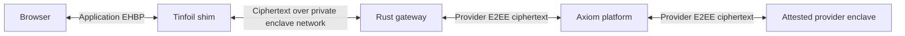

# Gateway architecture

The deployment target is a CPU-only Tinfoil Container on Intel TDX. Message
plaintext exists only in the browser, the attested gateway's protected memory,
and the authenticated upstream provider enclave. The ordinary platform, edge,
host and storage retain ciphertext and operational metadata only.

The shim supplies fresh nonce-bound attestation over an explicitly granted Unix
socket and exclusively mounted boot X25519/Ed25519 keys. The gateway decrypts
application EHBP itself using the attested X25519 key; separate header names
prevent the shim from intercepting application encryption. No ordinary-TLS-only
inference path exists. Public status and attestation endpoints contain no account
credentials or messages.

The pinned official Tinfoil Go verifier authenticates v3 evidence, nonce/report
binding, boot keys, Intel collateral/revocation/strict UpToDate status, Tinfoil
platform endorsements, workload measurement, Sigstore release identity and
freshness witnesses. The same wrapper runs in native gateway/backend executables
and in packaged browser WASM. Axiom's pinned publisher signs the measured release
artifact's mapping to source revision, dependency locks, image digest and origin.
This config publisher identifies the release workflow; it is not a per-commit
allowlist or user approval requirement. Exact measured artifacts and cryptographic
checks still apply to every supported update.

Startup loads measured configuration and granted keys, collects evidence, verifies
locally, and obtains an independently verified backend admission lease before
opening its listener. Policy/collateral refresh runs every 120 seconds; epochs
expire after 240 seconds and refresh failure cancels sessions and streams. Browser
proofs refresh before expiry and reconnect if a boot rotates either accepted key.

## Reuse and ownership

The gateway pins `axiom-inference`, `axiom-openai-compat` and
`axiom-secure-client` to one complete Desktop Git revision. It builds only these
libraries. Electron, local thread storage, TUI, installers, Agent mode and local
MCP launching are not gateway dependencies. Shared fixes belong in Desktop and
reach the gateway through a coordinated pin update, never copied provider code,
a submodule, or a neighboring checkout import.

`axiom-platform` owns hosted UI, login, billing, CSRF, grants, admission, search
and encrypted provider relay. Gateway source, SDK, attestation adapter and container
artifacts live here. Browser grants bind the account session and a nonextractable
P-256 key. Account-scoped relay authority remains separate from encryption keys;
there is no shared billable credential.

The gateway forwards provisional provider-authenticated deltas and emits a
successful encrypted terminal only after the upstream protocol authenticates
completion. Ordered frame counters, request identity and a transcript digest are
checked by the browser through EOF. Truncation, decryption errors, provider failure
or cancellation cannot become verified success.

The web UI's existing preview is still separate from live gateway integration.
Web search and original-file uploads are follow-on work, not implemented by this
migration. External search has its disclosed non-E2EE query boundary; uploads
must use upstream original-file capabilities, never PDF/text extraction fallbacks.
Browser-delivered JavaScript remains a separate trust boundary: gateway attestation
does not attest the website or prevent compromised browser code reading input.

See [protocol](protocol.md) and [deployment](tinfoil.md). Hosted acceptance,
provider live runs, isolation and load qualification remain required before
serving users; local tests are not hardware qualification.
