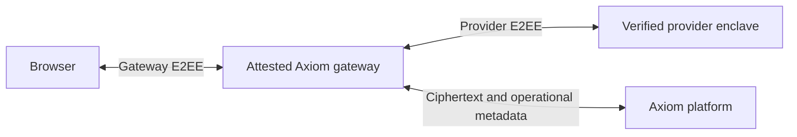

# Axiom Web Gateway architecture

## Status and decision

This repository currently establishes the Rust dependency foundation and the
architecture. It does not implement or deploy a gateway service.

The selected deployment target is an **Azure Intel TDX confidential VM**. Its
attestation must establish the identity of the gateway workload, not just the
presence of TDX hardware. Build a locked, measured guest appliance containing
the gateway container and its launch policy. Verify the hardware-backed vTPM
chain, guest measurements, build provenance and a fresh gateway key binding
before sending credentials or inference content. See the
[implementation plan](implementation-plan.md) for the qualification sequence.

Use the full gateway approach: browser messages are encrypted to an attested
gateway key, decrypted in gateway enclave memory, then encrypted using the
selected upstream provider's verified E2EE protocol. Provider responses are
authenticated and decrypted inside the gateway, then encrypted back to the
browser through its authenticated gateway session.

The backend can relay encrypted ingress traffic as well if account routing or
network topology requires it. It must not terminate the gateway encryption or
receive prompt/history/response plaintext. External search and tools have their
own explicit privacy boundaries; gateway attestation does not make an external
tool confidential.

This adds gateway code and hardware to the trusted computing base. It extends
the existing native-client architecture deliberately; it does not enable
plaintext inference in the ordinary backend. The proof UI should identify the
gateway and the upstream provider separately and explain delegated verification.

## Existing code to reuse

| Shared component | Existing responsibility | Gateway use |
| --- | --- | --- |
| `axiom-inference` | Transport-independent messages, attachments, model capabilities, requests, responses, tool calls, usage and events | Common domain contracts |
| `axiom-secure-client` | Provider registry, NEAR/Tinfoil attestation, signed trust policy, encrypted relay, provider encryption, response authentication and cancellation | Upstream security engine inside the enclave |
| `axiom-openai-compat` | Pure OpenAI request/response and stream translation | Optional compatibility envelope inside browser encryption |

Reuse the provider security implementation in full rather than reproducing
cryptography in the gateway. The local proxy application is a composition example
for these libraries; its loopback listener, local authorization and supervisor
are not suitable authorization boundaries for a public multi-user service.
Desktop/TUI rendering, local thread databases, local MCP process launching,
installation and updater code are outside this gateway's scope.

The shared client already talks to Axiom's account-scoped ciphertext relay and
accounting endpoints. Preserve that path where compatible. Its current
`ApiCredential` requires an Axiom credential: browser account authentication does
not automatically become authorized relay access. Delegation must be designed
and validated with the platform before the gateway accepts user requests.

## Source sharing

The root Cargo manifest pins all three shared crates to the same complete Git
revision of the public `axiom-desktop` repository. Cargo discovers workspace
crates within that repository and resolves their internal dependencies. It
fetches the repository, but builds only the required crates and their dependency
graph; Electron, the CLI and installer applications are not gateway dependencies.

Do not introduce a Desktop Git submodule, copied source directories or required
relative paths into a neighboring checkout. The gateway must build from its own
clone, its lockfile and accessible pinned dependencies. Shared fixes happen once
in the owning repository and reach the gateway through a reviewed pin update.
Desktop and gateway dependency updates need coordinated qualification; the
gateway does not automatically adopt a moving Desktop branch.

If this stack gains independent consumers or release requirements, move these
crates into a dedicated shared Rust repository. Change both Desktop and gateway
to consume that source, preserving one implementation and the existing APIs.
That extraction is not necessary to establish reuse now and has not been done.

## New work owned by the gateway

1. **Browser channel and SDK.** Use a reviewed encrypted transport with keys
   bound to fresh gateway attestation. Bind account authorization, protocol
   version, request ID, provider and model to the encrypted session. Authenticate
   frame ordering, cancellation and terminal completion. Do not invent an
   unauthenticated end marker or send plaintext through the ordinary backend.
2. **TEE image and provenance.** Select the deployment hardware/runtime, build
   the measured image and publish inspectable build provenance for source,
   dependencies and security-sensitive configuration. Define key generation,
   evidence freshness, rotation, supported hardware status and update handling.
   Azure Intel TDX is the selected platform. Qualify the exact VM family's
   hardware/vTPM evidence and custom measured-image support before relying on it;
   an application-supplied image hash is not workload attestation.
3. **Service composition and authorization.** Resolve each user's delegated
   relay authority and enforce expiry, quotas, request/body limits, concurrency,
   cancellation and tenant isolation. Do not use a single billable user API key
   for the entire gateway. Keep credentials separate from encryption key material.
4. **Verified response bridging.** Forward only provider-authenticated deltas,
   mark them provisional and produce successful authenticated browser completion
   only after upstream completion is verified. Preserve provider failures and
   cancellation without exposing plaintext diagnostic content.
5. **Platform integration.** Keep hosted web chat in `axiom-platform`. Define
   gateway discovery and the account/billing delegation contract there. Keep
   conversation persistence browser-side or encrypted using browser-held storage
   keys; inference channel keys are not automatically persistent storage keys.

## Implementation stages and acceptance

1. Foundation (present): commit-pinned dependencies, independent build, documented
   trust boundary and repository ownership. No inference listener.
2. Transport prototype: select a TEE platform and reviewed browser transport;
   independently verify the gateway image/key from a browser before enabling
   encrypted test requests. Publish the measured build's provenance.
3. Authenticated inference: implement bounded service composition around the
   shared secure client and platform-approved per-account delegation. Exercise
   provider protocols with encrypted fixtures and attested live checks.
4. Failure qualification: prove rejection of stale/substituted attestations,
   wrong keys/models/accounts, replay, invalid response authentication, truncated
   or reordered streams, disconnects, rotation and cross-account state access.
   Verify that logs, crash paths, storage and ordinary intermediaries contain
   no message plaintext or credentials.
5. Web integration and release: add the hosted UI and delegated privacy proof,
   qualify concurrency and upgrades, then promote and deploy only when explicitly
   authorized. Gateway validation must not publish a Desktop release.

The browser still trusts the JavaScript it runs. A compromised website can serve
code that reads a message before encryption. Gateway attestation does not prove
the integrity of client JavaScript; client distribution/integrity protections
and this limitation must be documented separately.

## References

- [Cargo Git dependencies](https://doc.rust-lang.org/cargo/reference/specifying-dependencies.html#specifying-dependencies-from-git-repositories)
- [Axiom Desktop shared crates](https://github.com/astrea-foundation/axiom-desktop/tree/8c4cb115f3b7fdcf5ca13d6c41efc1459c6b9fad/crates)
- [Tinfoil attested router architecture](https://tinfoil.sh/security-and-privacy-faq)
- [Tinfoil browser verification and client integrity](https://tinfoil.sh/blog/2025-12-18-browser-native-verification)
