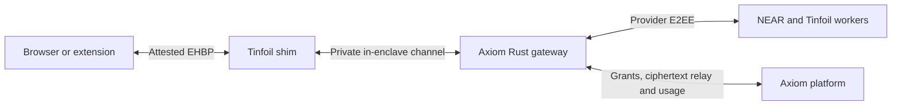

# Tinfoil Containers migration plan

Date: 2026-10-06. Status: planned; no runtime migration or cloud deployment has
been performed. Baseline: gateway `dev` revision
`1a397fe827c26fed8a4941f9d4e683b8f2864696`.

Move the Axiom Web Gateway from the unqualified Azure Intel TDX appliance to a
Tinfoil Container. Keep Rust, both upstream providers, account-scoped billing
and authenticated browser streaming. Tinfoil becomes the gateway hosting and
attestation platform; it does not replace Axiom's inference or account service.

The existing [Azure implementation plan](implementation-plan.md) describes the
code already present. This document is the active plan for the next deployment
target. Azure qualification is no longer the next delivery milestone.

## Scope and ownership

| Repository | Work |
| --- | --- |
| `axiom-web-gateway` | Tinfoil evidence adapter, native verifier artifact, browser SDK, Rust service transport adapter, image and deployment configuration |
| `axiom-platform` | Admission verification, discovery/trust documents, delegated account contract, browser privacy proof and live chat integration |
| `axiom-desktop` | Shared verifier/provider changes only if needed; retain one implementation and update all three pinned Cargo dependencies together |
| Separate config repository | Public measured Tinfoil configuration and its release artifacts; gateway source remains private during development |

Keep checkouts independently buildable. SDK and verifier consumers use versioned
artifacts; no neighboring source imports, copied provider code or Desktop Git
submodule. Development and coordinated PRs target `dev`. Production artifacts
must come from an explicitly promoted `main` revision. Gateway testing never
bumps Desktop versions or publishes Desktop installers.

Web search and original-file uploads remain follow-up browser features. This
migration must preserve their future encrypted request path, but does not add
Agent mode, MCP process execution, PDF extraction or ordinary backend file
storage. The hosted browser preview remains separate from live inference.

## Proposed architecture

Use Tinfoil's attested shim as the single browser EHBP encryption endpoint. The
shim and Rust gateway run inside the same measured confidential VM. The Rust
service receives decrypted requests only over the enclave's private internal
channel, then applies Axiom authorization and provider-E2EE checks.

Keep the application envelope, P-256 sender constraints, request IDs, cancellation
and stream sequence/terminal digest. Introduce `axiom-gateway-v2` for the new
transport/evidence contract; do not reinterpret Azure v1 evidence as Tinfoil
evidence. There is no negotiation down to plaintext or ordinary TLS.

Replace `transport::Identity` as the production browser encryption endpoint with
the shim's locally verified HPKE key. Retain a distinct Ed25519 gateway signing
key for backend admission and grant exchange. Prefer Tinfoil's boot-generated
attested key, granted exclusively to the gateway container. Its public key must
be endorsed by the same evidence that establishes the workload and shim key.
Tinfoil's canonical configuration supports Ed25519/X25519 boot keys and v3 key
endorsement; actual runtime and SDK compatibility remain a phase-0 gate.
[Attested key contract](https://github.com/tinfoilsh/tinfoil-config#attested-boot-keys)

Avoid two nested EHBP transports using the same headers. If the managed shim
cannot preserve our completion or key-binding requirements, stop and revise
this design explicitly before implementing a different transport.

## 0. Qualify the platform contract first

Build a minimal non-sensitive development probe, not an inference bypass.
Confirm a CPU-only Intel TDX instance is available to the organization, retaining
the existing hardware choice. AMD SEV-SNP support would be a separate reviewed
policy change, not an automatic fallback. No GPU or persistent volume is needed.

Record and pin the actual CVM/shim version, configuration schema, attestation
format and compatible JavaScript/native verifier versions. The current Axiom
Tinfoil inference adapter is tied to the hosted inference contract; its pinned
Rust SDK must not be assumed to verify arbitrary containers or newer v3 keys.
Tinfoil's general predicate documentation describes older formats, while newer
source documents boot-key endorsement. Resolve that difference using the pinned
implementation and captured live evidence, not a version-name assumption.

Prove these requirements before changing account delegation:

1. Hardware signatures, current collateral, strictly UpToDate Intel TDX TCB,
   CVM measurements and measured deployment configuration verify locally against
   independently trusted roots. No shared-gateway outdated-TCB exception applies.
2. A fresh random challenge is authenticated by the evidence. A recent release
   timestamp or a signed nonce from an otherwise unbound application is
   insufficient. Verify the exact nonce encoding and report-data binding.
3. Evidence binds the shim's HPKE key and the gateway's Ed25519 public key to
   the same measured instance. Reject missing, wrong, duplicate or differently
   granted keys. Check the private/public key pair and exclusive container grant.
4. The deployed OCI digest and security-sensitive configuration match the
   authenticated build/config provenance. Another valid Tinfoil workload must
   not be accepted as Axiom's gateway.
5. The browser SDK performs full verification in a browser/extension and sends
   encrypted bodies, without an attestation-service boolean or TLS-only mode.
6. The shim preserves request bodies, streaming/backpressure, cancellation and
   the authenticated application terminal. Unencrypted requests, including
   ordinary HTTPS bodies, cannot reach protected handlers; direct access to the
   application port is rejected.

Capture public evidence without account data. Run the same altered-key,
altered-image and nonce-replay corpus through browser and native verification.
**Exit gate:** a documented supported version matrix, verified positive proof
and rejected negative proofs. If a requirement is unavailable, keep inference
disabled and resolve the platform limitation; do not weaken verification.

## 1. Define versioned proof and release contracts

Refactor the Azure-specific types in `crates/axiom-gateway-protocol` into a v2
Tinfoil proof envelope and common authorization/stream contracts. Keep raw
evidence bounded and return only a verified projection: platform, canonical
origin, encryption/signing keys, measured config/image, source/build provenance,
policy generation/sequence and hard expiry.

Use pinned, reviewed Tinfoil verification libraries for hardware, Sigstore and
platform endorsement checks. Prefer the official JavaScript verifier for the
browser and a thin native verifier executable wrapping the supported native
library. If Rust support is insufficient, a Go verifier artifact is acceptable;
the gateway itself remains Rust. Reuse that native adapter for gateway
self-verification and platform admission. Do not implement a second hardware
signature verifier or copy the hosted-model provider adapter.

Retain Axiom's signed publisher policy for canonical origins, supported platform
security, minimum workload generation, expiry and revocation. Replace PCR11
lookup documents with container build/config provenance. Bind the source
revision, lockfiles, build recipe and OCI digest to the measured deployment;
an image hash alone is not source provenance. Authenticate the release
publisher/workflow and its artifact chain. Verify compatible updates
automatically; repository/commit allowlists or user approval of every update
are not substitutes for measured provenance.

Clients obtain the current policy independently of the attester and persist
the highest accepted policy sequence. Prevent rollback to older otherwise
valid configuration releases. Initially retain the 24-hour publisher-policy
expiry and 240-second maximum evidence epoch, with 120-second renewal, unless
live qualification requires a stricter bound. Fresh challenges remain required
for connection and admission.

**Exit gate:** versioned schemas, expiry/rollback rules, native and browser
verification parity, and a documented compatibility boundary with Azure v1.

## 2. Adapt the Rust gateway and container

- Replace Azure IMDS/HCL/vTPM/PCR collection in `attestation.rs` and `main.rs`
  with Tinfoil's supported local evidence interface. Grant local attestation
  access only to the gateway. Remove Azure metadata-network dependencies.
- Load the exclusively granted Ed25519 key from its protected boot-key mount,
  validate its algorithm/public key and avoid logging or exporting private
  material. Use the verified shim HPKE key for browser DPoP binding; never
  accept an unauthenticated public-key endpoint.
- Replace production EHBP decryption/encryption in the Rust HTTP adapter with
  the shim's private in-enclave transport. The business handlers still require
  the exact v2 envelope, body bounds and sender proof. No request/header claiming
  to come from the shim is sufficient authorization.
- Keep the application port unpublished outside the private shim channel.
  Qualify how the shim enforces encrypted-only protected paths. Local fixtures
  may exercise handlers in-process; do not ship a public plaintext dev listener.
- Open serving readiness only after local evidence verification and backend
  admission. On renewal failure or expired/revoked policy, stop new sessions,
  cancel active runs and fail closed. A health check is never attestation.
- Retain the shared provider client, strict upstream policy, per-account
  credentials/cache secrets, quotas, deadlines and authenticated completion.

Bake non-secret security-sensitive configuration into the image or measured
Tinfoil config: origins, backend endpoints, runtime options and capacities.
Reject unmeasured environment overrides. Use the existing minimal image as the
starting point; run non-root with a read-only root, bounded volatile scratch
space, no core dumps, no privileged/admin container and no production SSH/debug
access. Account relay credentials remain ephemeral; no shared billable user key
or permanent provider credential is required.

**Exit gate:** container starts only with accepted evidence/admission, transport
fixtures pass through the real shim, and ordinary/debug/wrong-config instances
cannot serve protected chat traffic.

## 3. Update platform admission and account delegation

In `axiom-platform`, adapt `backend/src/axiom_api/web_gateway/routes.py`,
discovery/trust documents and the verifier image contract to v2. Preserve
database-backed challenges, one-use browser grants, CSRF/Origin checks, P-256
DPoP, signed Ed25519 exchange, login revocation and account quota reservations.

At registration the backend must independently verify the fresh Tinfoil proof,
measured gateway config, both keys, current Axiom policy and signing-key
possession before storing an admission lease. Existing `axw_`, `axl_` and `axg_`
token concepts may remain; their authority must explicitly identify the v2
instance and accepted encryption key. Do not trust a browser's verification
result, a Tinfoil hostname or an asserted gateway header.

Update `backend/Dockerfile.web-gateway` to consume an immutable verifier OCI
artifact. Keep bounded subprocess work, sanitized errors and no-store responses.
Backend proof retrieval/verification must never carry prompts, files, message
hashes or assistant text. Keep pseudonymous delegation and existing aggregate
load budgets; gateway egress must not collapse all users into one client quota.

Version discovery and reject mismatched SDK/proof/instance contracts. Add a
schema migration only if the existing instance records cannot distinguish
version/platform safely. Avoid accepting both formats through heuristic parsing
or treating an expired Azure lease as a Tinfoil lease.

**Exit gate:** an accepted Tinfoil instance can exchange a real browser grant;
unverified instances, replay, key substitution and cross-account requests cannot.

## 4. Adapt the browser SDK and hosted proof UI

Replace the Azure WASM verification entry point in `sdk/src/index.ts` with the
qualified Tinfoil verifier/secure transport. Keep the public `connect`/`rpc`
shape where possible; explicitly version incompatible results/options. Verify
the accepted key/config/policy before sending the grant or any model content.
Continue to use a nonextractable P-256 authorization key separate from transport
encryption. Credentials and RPC proofs belong inside EHBP bodies, not URLs or
outer authorization headers.

Keep `sdk/src/frames.ts` ordering, request identity, terminal digest and clean
EOF checks. AEAD chunks remain provisional; a generic shim EOF is not successful
completion. Respect Stop/disconnect and never automatically retry a possibly
dispatched inference. On key rotation/update, discard the session, verify the
new instance and acquire a fresh grant. Package verifier assets with the SDK
and extension; never fetch executable verification code from the attester.

Update `axiom-platform/chat/` to display gateway hosting separately from the
selected inference provider. Show hardware, measured gateway build/source and
upstream verification only when supported by accepted evidence. Keep verified
reply state bound to the completed request. Hosting on Tinfoil must not imply
that every selected model is a Tinfoil model.

Align browser, SDK, shim and service body limits before enabling future uploads;
the SDK currently allows only 3 MiB. Count encoding overhead, history and
aggregate memory rather than blindly copying Desktop's per-file limit. Browser
search stays an explicit non-E2EE query exception; uploads remain original bytes
and provider/model-capability gated. Those feature implementations are separate
from this migration. Live WebCrypto/gateway use requires an approved HTTPS
origin; the HTTP LAN preview is not the live security test environment.

**Exit gate:** headless browser and extension-compatible SDK checks pass for
verification, account admission, both providers and interrupted streams.

## 5. Prepare measured deployment and release artifacts

Prepare a separate configuration-only repository, provisionally
`axiom-web-gateway-config`. Tinfoil requires public configuration while source
and image may remain private; publishing that repo needs separate authorization
under the current private-development policy. Private registry access is an
enterprise feature to confirm before choosing image distribution.
[Configuration visibility and private registries](https://docs.tinfoil.sh/containers/private-images)

Prepare `deploy/tinfoil/` templates locally with a pinned OCI digest, qualified
CVM version, CPU-only resources, exclusive signing-key grant and private shim
routing. Explicitly configure outbound hostnames for Axiom's API, provider
evidence and cryptographic collateral/provenance. Permit only approved browser
origins and necessary public paths; include the required attestation endpoints.
Tinfoil containers have closed egress by default, so document and test the
complete endpoint inventory. [Networking](https://docs.tinfoil.sh/containers/config-networking)

Start with one stateless instance, no persistent volume and no plaintext
conversation storage. Scaling later needs instance routing: verification and
sessions must stay bound to the actual instance/key. Do not put a plaintext
load balancer before the encryption endpoint or promise that managed
blue/green updates preserve an in-flight application session. Tinfoil does not
provide inter-instance load balancing. [Platform limitations](https://docs.tinfoil.sh/containers/overview)

Keep CI limited to required checks and release artifacts. Reuse the existing
gateway check job; add only necessary config/verification checks. Artifact
publication should produce the OCI image, source/build provenance, native
verifier and SDK plus vendor-required measured config release artifacts. Pin
build actions/dependencies and restrict publishing credentials/OIDC to the
release authority. No scheduled workflows, automatic production deployment or
Desktop release matrix is introduced.

Keep build/publish separate from rolling out a container instance. Development
images/config releases come from explicit staging work; production uses the
promoted `main` revision. A tag or successful image build is not a qualified
deployment. Tinfoil's release and instance-update steps are separate.
[Update lifecycle](https://docs.tinfoil.sh/containers/updates)

**Exit gate:** independently buildable artifacts, complete provenance, validated
config and an authorized staging instance with the intended measured runtime.

## 6. Qualify, cut over and retire Azure

Run local Rust format/clippy/tests, native verifier and browser SDK tests,
backend delegation tests, and Docker/Podman builds. Test the actual SDK and
native verifier with captured public evidence; mocked acceptance is not live
qualification. Run live browser → container → attested NEAR and Tinfoil requests
on staging before claiming the migration works.

| Case | Required result |
| --- | --- |
| Valid workload and fresh proof | Both independent verifiers accept the same keys/image/config |
| Wrong image/config/key grant, debug/admin workload, unsupported hardware or TCB | Reject before credentials or model content are sent |
| Replayed nonce, stale collateral/policy, rolled-back/revoked build | Reject without granting relay authority |
| Altered sender proof, expired lease, logout, wrong account/session | Reject; no cross-account billing or state access |
| Changed shim/key after update | Fresh verification and grant required; old session fails closed |
| Tampered/reordered/truncated stream, missing upstream authentication or terminal | No verified success or automatic billable retry |
| Stop, tab disconnect, renewal failure, overload/backpressure | Bounded resources and upstream cancellation |
| Canary prompts/files/credentials | Absent from host/edge/backend logs, metrics, proof bundles and crash artifacts |

Exercise parallel accounts, provider quotas, replay memory bounds and update
behavior at configured maximum concurrency. Collect latency/memory/capacity
results without payload text. A CPU gateway still performs crypto and evidence
work; choose resources from measurements rather than a concurrency guess.

Prepare the final rollout/runbook with a dated qualification record, canonical
HTTPS origin, published trust metadata, shutdown/reconnect behavior and emergency
disable/revocation. Promote to `main` and enable production only when explicitly
authorized. There is no currently qualified Azure production service to fall
back to: failures disable the gateway. A rollback must select a still-accepted
qualified Tinfoil build; never lower the security generation to restore service.

After successful Tinfoil qualification, remove Azure SDK dependencies,
`deploy/azure/`, the UKI appliance builder, TPM verification and PCR-manifest
publishing from active builds/CI. Consolidate current protocol/operations docs
and retain the dated local Azure QA record only as historical evidence. Extract
any still-relevant acceptance work before removing the older plan. Until then,
leave the existing implementation intact and clearly distinguish it from the
planned target.

**Completion:** real browser login, locally verified container/key/provenance,
correct per-account billing, both attested upstream providers, authenticated
stream completion, tested updates/failures and no plaintext outside the browser,
gateway enclave or provider enclave.

## Work order and prerequisites

Implement in reviewed batches: (1) probe/version matrix and proof contract,
(2) native/browser verification plus backend admission, (3) Rust shim adapter
and SDK transport, (4) measured image/config artifacts and hosted proof UI,
(5) live qualification/runbook, (6) authorized cutover and Azure retirement.
Each batch targets `dev`; tests stay on local or staging artifacts.

Before cloud work: obtain Tinfoil organization/container access, Intel TDX
capacity confirmation, compatible attested-key/nonce support, a registry path
and HTTPS staging origin. Confirm private-registry entitlement and permission
to publish the separate config repo. These are implementation prerequisites,
not reasons to publish or change visibility while writing this plan.

Budget several focused development days for the first qualified test path and
roughly 1–2 weeks for the coordinated migration and validation, excluding
account provisioning, hardware availability and any upstream SDK gaps. Reassess
after phase 0; this estimate does not include Web search/upload implementation
or production authorization.
